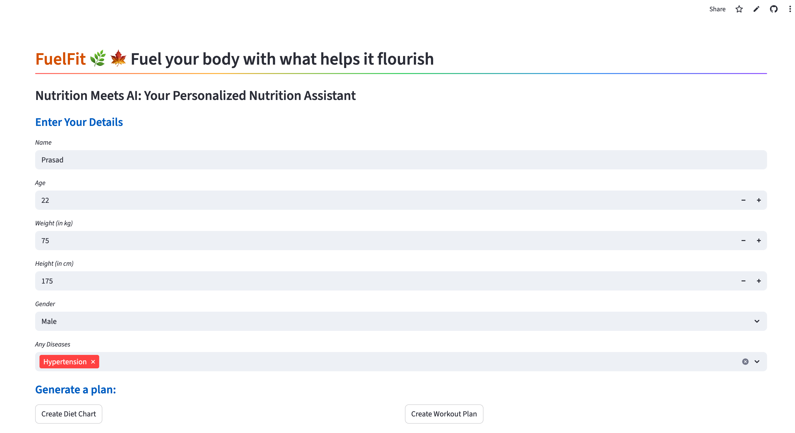
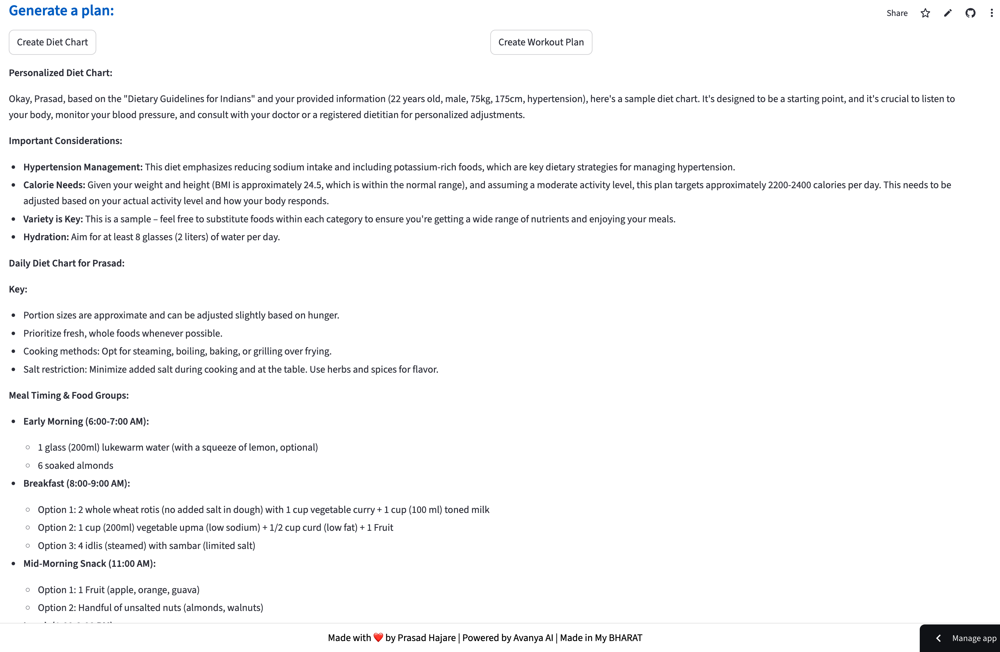

# 🌿 FuelFit – Personalized Nutrition & Fitness Assistant

**FuelFit** is an AI-powered Streamlit application that generates personalized **diet** and **workout plans** using Retrieval-Augmented Generation (RAG). It analyzes evidence-based nutrition content from a PDF and your health inputs to provide tailored recommendations.

---

## 🚀 Features

- 📄 Automatically downloads a nutrition PDF and creates a searchable vector database
- 🔍 Uses FAISS + HuggingFace embeddings for intelligent document retrieval
- 💬 Generates personalized diet & workout plans with context from the PDF
- 🧠 Powered by Google Gemini and LangChain for high-quality content generation
- 🧑‍⚕️ Health input form for name, age, weight, height, gender, and existing diseases
- 🌐 Streamlit-based UI, responsive and user-friendly

---

## 🖥️ Demo

> *“Fuel your body with what helps it flourish.”*



---

## 📁 Project Structure

```
FuelFit/
├── app.py                  # Main Streamlit application
├── images/                 # Screenshots or UI images
├── requirements.txt        # Python dependencies
└── README.md               # Project documentation
```

---

## ⚙️ Technologies Used

- **Streamlit** – Web app framework
- **Google Gemini Pro** – Text generation via Generative AI
- **FAISS** – Fast document vector search
- **LangChain** – Prompt chaining and RAG orchestration
- **HuggingFace Embeddings** – Semantic embeddings for document chunks
- **PyPDF2** – PDF parsing and text extraction
- **dotenv** – API key management
- **Requests + Tempfile** – Secure PDF download and caching

---

## 📦 Setup Instructions

### 1. Clone the Repository

```bash
git clone https://github.com/PRASADHAJARgw/Nutrition-RAG.git
cd Nutrition-RAG
```

### 2. Install Python Dependencies

```bash
pip install -r requirements.txt
```

### 3. Set Environment Variables

Create a `.env` file in the root directory:

```env
GOOGLE_API_1=your_google_api_key_here
```

### 4. Run the App

```bash
streamlit run app.py
```

The app will open in your browser at `http://localhost:8501`.

---

## 🧠 How It Works

1. **PDF Loading**  
   - Downloads a health PDF from a shared Google Drive link  
   - Extracts and splits text into chunks  
   - Converts chunks into vectors using HuggingFace model  
   - Stores the index in FAISS for fast semantic search

2. **User Input**  
   - Collects personal and health details via the UI

3. **Diet/Workout Generation**  
   - Retrieves relevant chunks from PDF  
   - Passes user details + context to Google Gemini  
   - Gemini generates a structured, human-like plan

---

## ✅ Example Prompts Used

- *"Create a detailed, personalized diet chart for a person named John, age 32, weight 70kg, height 175cm, diseases: Thyroid, gender=Male..."*
- *"Use the PDF context to generate a week-wise workout plan tailored to a female aged 45 with hypertension..."*

---

## 📸 Screenshots

| Health Input Form | Personalized Output |
|------------------|---------------------|
|  |  |

---

## 🙋‍♂️ Author

**Prasad Hajare**  
📧 prasadhajare2000@gmail.com  
🔗 [LinkedIn](https://linkedin.com/in/prasad-hajare)

---

## ❤️ Credits

- [Google Generative AI](https://ai.google.dev/)
- [LangChain](https://www.langchain.com/)
- [HuggingFace Transformers](https://huggingface.co/)
- [Streamlit](https://streamlit.io/)

---

## 📄 License

This project is licensed under the [MIT License](LICENSE).

---

## 🧠 Quote

> *"Made with ❤️ by Prasad Hajare |  "Powered by Avanya AI",
    "[Powered by Avanya AI](https://avianya.com)"| Made in My BHARAT 🇮🇳"*
"""